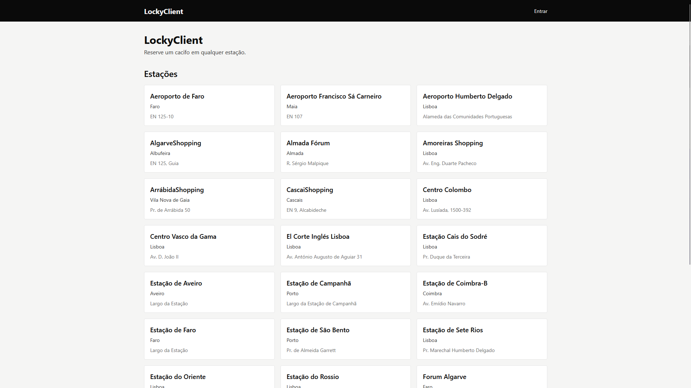
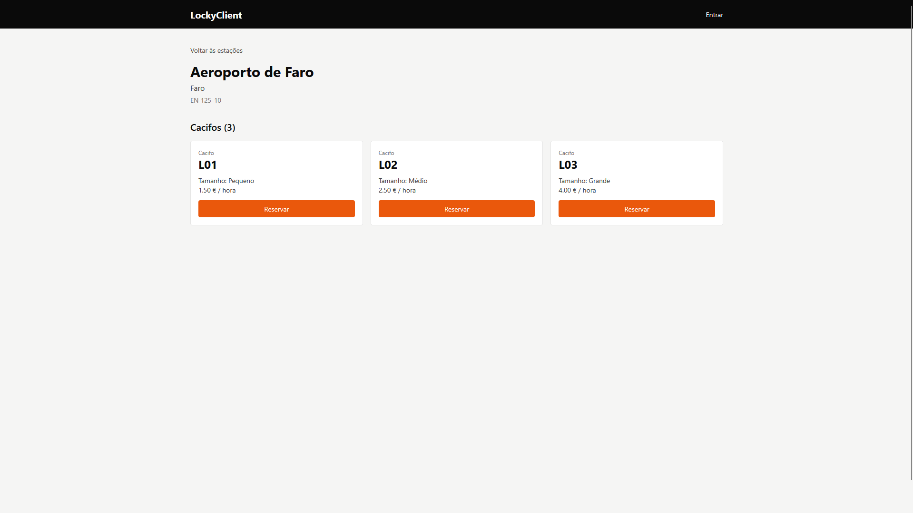
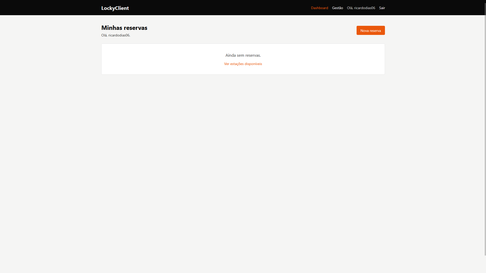
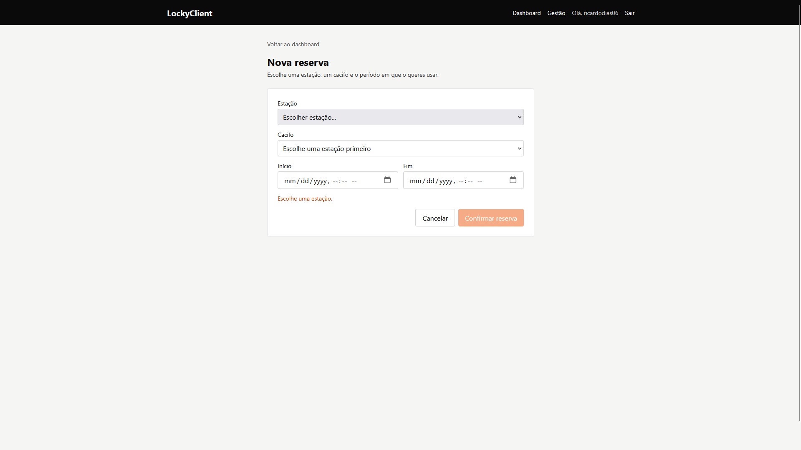
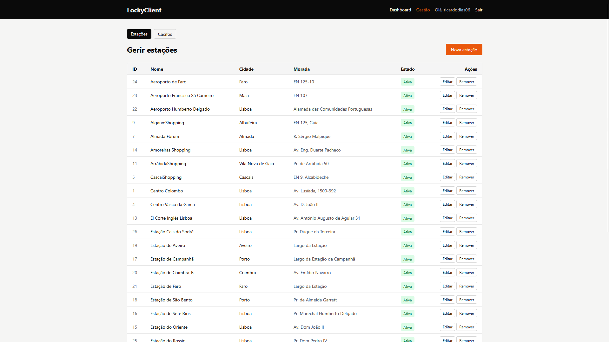
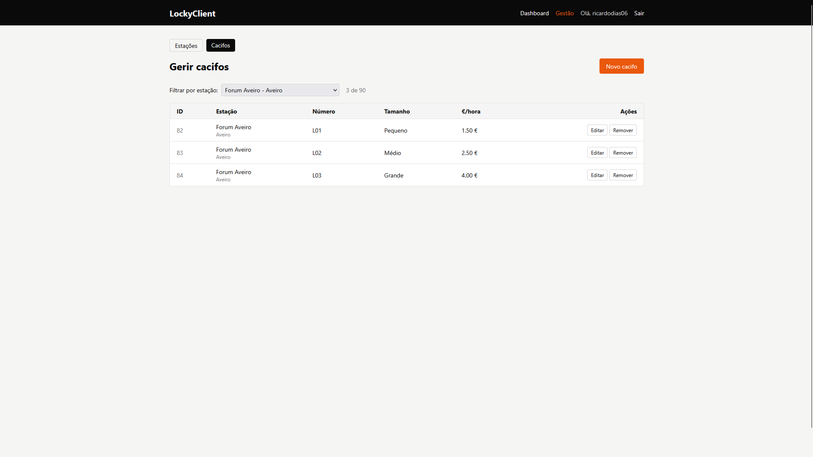

# LockyClient

Frontend ReactJS para o sistema de gestão de cacifos LockyAPI, desenvolvido no âmbito do M2 da unidade curricular de Desenvolvimento Web II.

> M2 - DWEB II (UMAIA, 2025/2026)
>
> Grupo `inf25dw2g02`; Membros: Ricardo Dias (A047068@umaia.pt)

## Descrição do tema

A LockyAPI (desenvolvida no M1) é uma API REST para gestão de cacifos inteligentes, inspirada nos cacifos públicos da Locky Portugal. Neste M2 implementei o frontend que a consome: páginas públicas para consultar estações e cacifos, autenticação via GitHub OAuth e uma área autenticada para gerir reservas e administrar o catálogo.

A documentação está escrita em [Markdown](https://www.markdownguide.org/).

## Organização do repositório

* **Código-fonte** está em [`src/`](src/).
* **Capítulos do relatório** estão em [`doc/`](doc/).
* **Configuração Docker** na raiz: [`Dockerfile`](Dockerfile), [`Dockerfile.dev`](Dockerfile.dev), [`docker-compose.yml`](docker-compose.yml) (produção) e [`docker-compose.dev.yml`](docker-compose.dev.yml).
* **Configuração Nginx** em [`nginx.conf`](nginx.conf).
* **Repositório da API adaptada** (fork do M1): <https://github.com/UMAIA-DWEB/locky-api-m2>

## Galeria

| Homepage | Detalhe de estação |
| :---: | :---: |
|  |  |

| Dashboard | Nova reserva |
| :---: | :---: |
|  |  |

| Gestão de estações | Gestão de cacifos |
| :---: | :---: |
|  |  |

## Tecnologias

* [React 18](https://react.dev)
* [Vite 6](https://vitejs.dev)
* [react-router-dom v6](https://reactrouter.com)
* [Tailwind CSS v3](https://v3.tailwindcss.com)
* [fetch](https://developer.mozilla.org/en-US/docs/Web/API/Fetch_API) (Web API nativa)
* [Express 5](https://expressjs.com), [Sequelize 6](https://sequelize.org), [Passport](https://www.passportjs.org/) (reutilizados do M1)
* [MySQL 8](https://www.mysql.com/)
* [Docker Compose](https://docs.docker.com/compose/) + [Nginx](https://nginx.org/)

### Bibliotecas adicionais

* [Docker](https://www.docker.com/) (Docker Desktop em Windows)
* [DockerHub](https://hub.docker.com/u/inf25dw2g02) para distribuição das imagens
* [GitHub OAuth](https://docs.github.com/en/apps/oauth-apps) para autenticação

## Relatório

### Apresentação do projeto

* Capítulo 1: [Apresentação do projeto](doc/c1.md)

### Recursos

* Capítulo 2: [Recursos](doc/c2.md)

### Produto

* Capítulo 3: [Produto](doc/c3.md)

### Apresentação

* Capítulo 4: [Apresentação](doc/c4.md)

## Equipa

* Ricardo Dias [@ricardodias06](https://github.com/ricardodias06)
